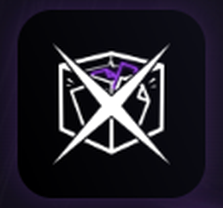
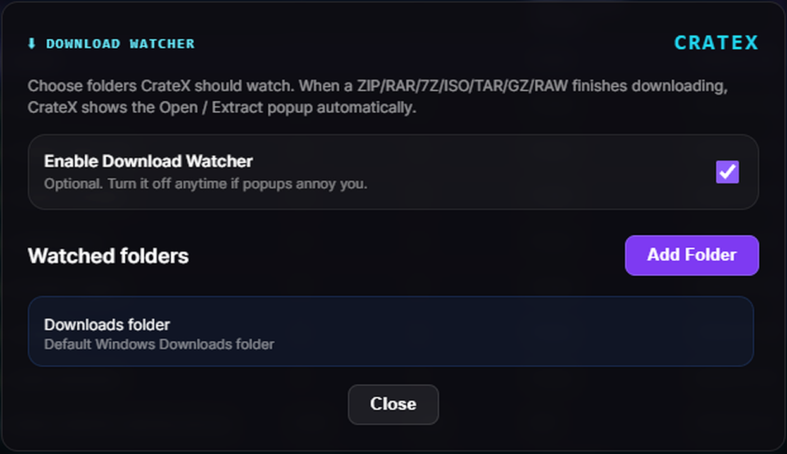
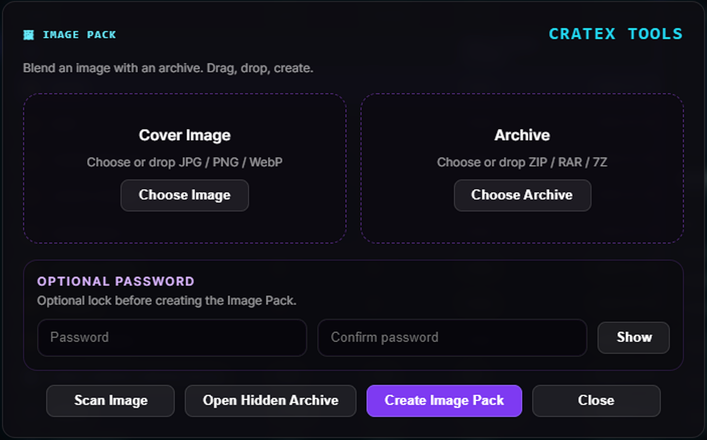
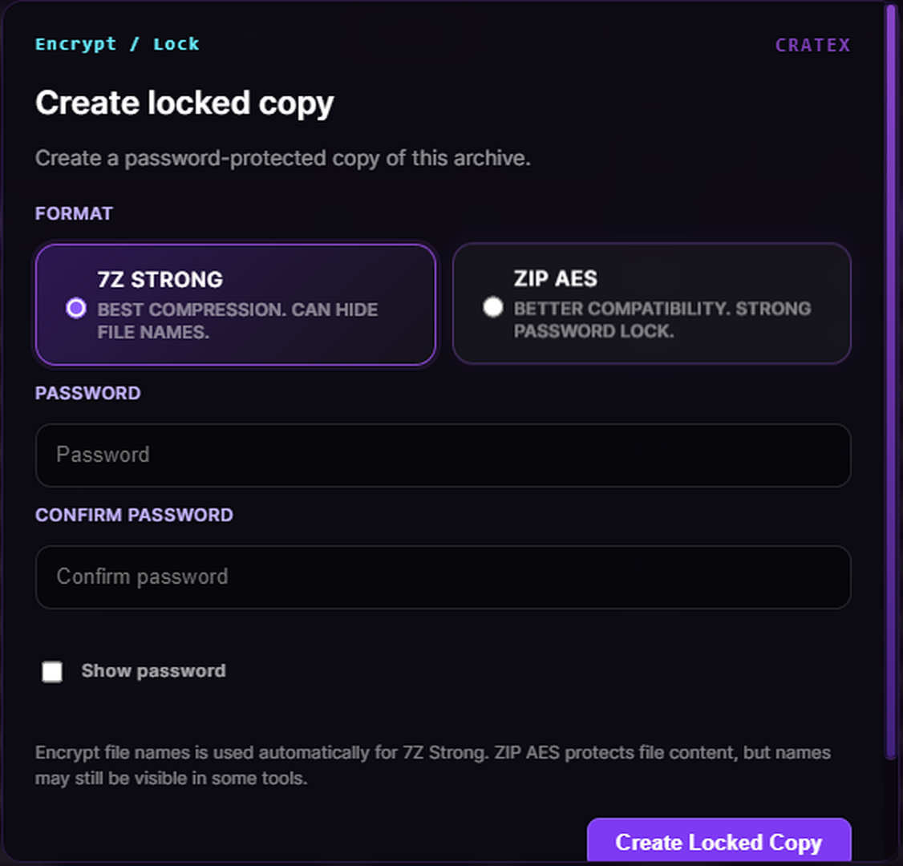
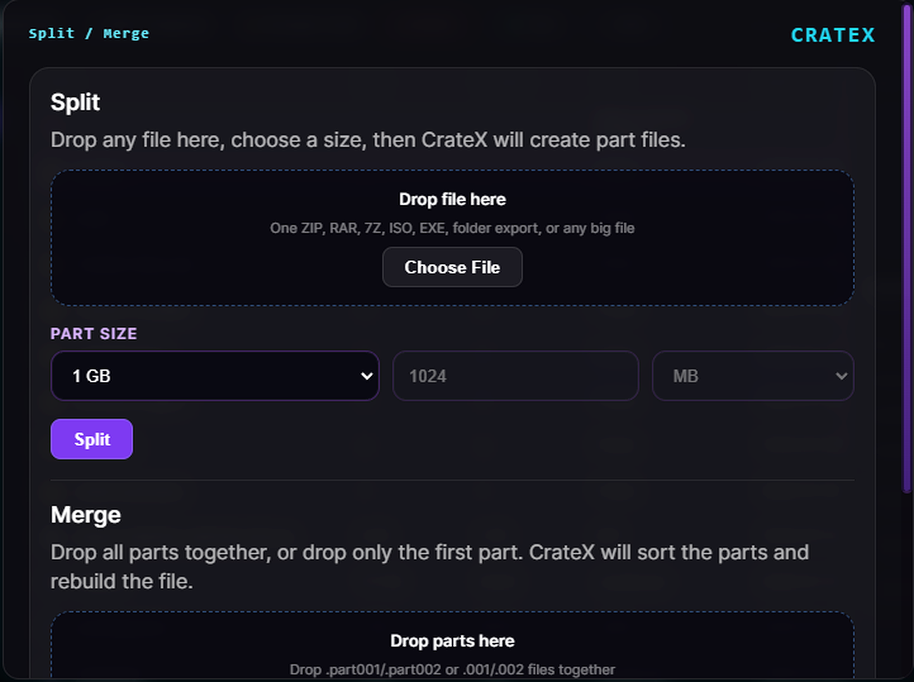
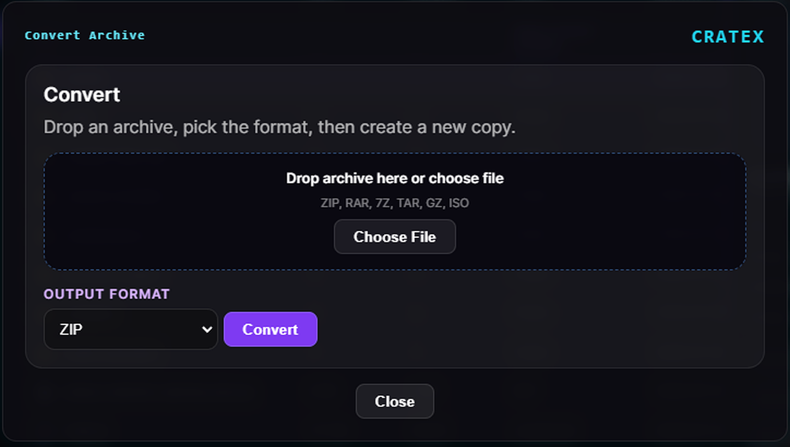

# CrateX

  

<h3 align="center">Crack the crate.</h3>

  A modern archive manager for Windows designed to remove repetitive archive workflows.

  <a href="https://since99s.github.io/crateX/"><strong>Visit the website</strong></a>
  ·
  <a href="https://github.com/since99s/crateX/releases/latest"><strong>Download setup</strong></a>
  ·
  <a href="terms.html"><strong>Terms of use</strong></a>

---

## Why CrateX?

Traditional archive work often means opening menus, finding more options, choosing an action, and repeating the same steps every time.

CrateX puts the important actions first:

- Open and browse archives
- Extract Here
- Extract To
- Extract Selected
- Batch extract multiple archives
- Compress files and folders
- Encrypt and lock archives
- Convert archive formats
- Split and merge large files
- Test archive integrity
- Preview supported files
- Use Download Watcher for completed downloads

---

## Batch extraction

Select multiple archives directly inside CrateX and extract them in one operation.

Choose how the extracted files are organized:

- **Separate folders** — CrateX creates one folder for each archive
- **One destination folder** — CrateX extracts all selected archives into the same chosen folder

This batch-extraction feature is available inside the CrateX application.

---

## Download Watcher

  

Download Watcher can monitor your Downloads folder or folders you choose. When a supported archive finishes downloading, CrateX can immediately present useful archive actions.

---

## Image Pack

  

Combine a JPG, PNG, or WebP cover image with an archive, optionally protect it with a password, and reopen the hidden archive later through CrateX.

---

## Encryption

  

Create password-protected archive copies with practical format options while keeping the original archive untouched.

---

## Split and Merge

  

Split large files into numbered parts using preset or custom sizes, then merge them back in the correct order.

---

## Archive Converter

  

Convert supported archives into another format without manually extracting and rebuilding them.

---

## Supported formats

`ZIP` · `RAR` · `7Z` · `ISO` · `TAR` · `GZ` · `RAW`

---

## System requirements

- Windows 10 or Windows 11
- 64-bit system
- Administrator permission during installation

---

## Important

Always keep backups before modifying, encrypting, converting, deleting, repairing, splitting, or merging important files.

By downloading or using CrateX, you agree to the Terms of Use and Disclaimer available on the website.

---

  © Jason Para. All rights reserved. CrateX™

